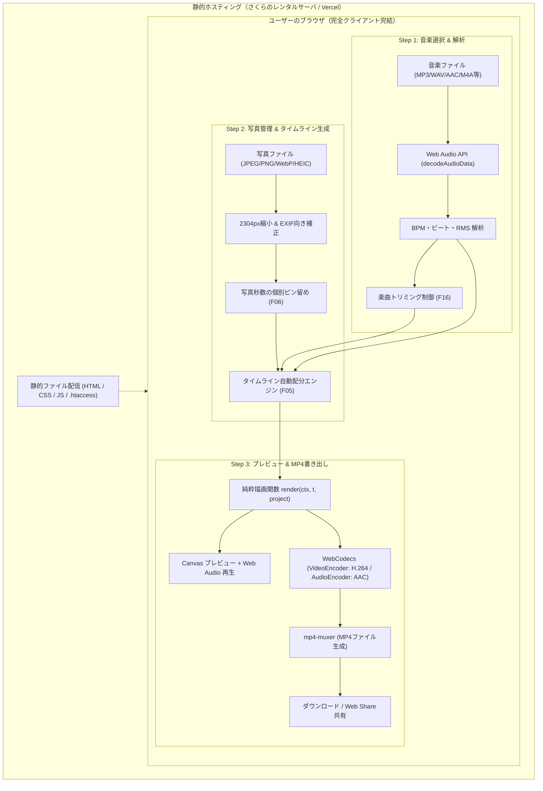

# Kanaderu（カナデル）要件定義書・画面設計書 兼 操作マニュアル

> **Kanaderu（カナデル）** — 音楽1曲と写真を選ぶだけ、曲の尺と雰囲気に合ったムービーを完全ブラウザ内処理で自動生成
> **作成日**：2026-08-19 ／ **バージョン**：v1.0 正式版 ／ **ステータス**：実装完了・本番対応

---

## 1. プロジェクト概要

### 1-1. コンセプト
**「音楽1曲と写真を放り込むだけ。専門知識ゼロで、曲のリズムと尺に完全にシンクロした高品質なショートムービー（MP4）を自動生成する」**

### 1-2. システムの特徴
- 🔒 **完全クライアントサイド動作（プライバシー保護 & サーバー負荷ゼロ）**:
  写真・音楽・動画エンコード処理がすべてユーザーのブラウザ・端末内で完結。サーバーへ写真や個人データが一切送信されません。
- ⚡ **WebCodecs + mp4-muxer による高速・軽量エンコード**:
  FFmpeg 等の重いサーバー処理や WebAssembly の巨大バイナリを排除し、OS ネイティブのハードウェアアクセラレーションを活用した超高速 MP4 出力を実現。
- 🎵 **インテリジェントな楽曲解析 & ビート同期**:
  楽曲のテンポ（BPM）・ビート位置・エネルギー（RMS）を自動解析し、写真の切り替えタイミングをビートに自動スナップ。
- 🎨 **多彩なメリハリ・トランジション & 決定論的 Ken Burns 演出**:
  ビートフラッシュ、クラッシュズーム、プッシュスライド、シネマティック光フレア、ディップ・トゥ・ブラック、クロスフェードをサポート。乱数シード固定によりプレビューと書き出しで 100% 同一の映像を出力。

---

## 2. システムアーキテクチャ



---

## 3. 機能要件一覧（詳細仕様）

| ID | 機能名 | 詳細仕様 |
|---|---|---|
| **F01** | 音声ファイル読み込み | MP3, WAV, AAC, M4A, FLAC, OGG に対応。ドラッグ＆ドロップおよびファイル選択ダイアログ。 |
| **F02** | 楽曲解析 & 曲調判定 | Web Audio API による BPM 推定、ビート打点検出、RMS（音圧）解析。曲調を「ゆったり」「スタンダード」「アップテンポ」に自動分類。 |
| **F03** | 楽曲トリミング | 開始位置・終了位置スライダーによる使用区間指定（最短 5 秒〜全尺）。区間の即時試聴再生に対応。 |
| **F04** | 写真一括読み込み & 最適化 | JPEG, PNG, WebP, iPhone 写真 (HEIC/HEIF) に対応。メモリ保護のため長辺 2304px へ事前リサイズし、EXIF の回転情報を自動補正。 |
| **F05** | 写真の並べ替え・削除 | サムネイル一覧での直感的なドラッグ＆ドロップ並べ替え、個別削除、一括削除。 |
| **F06** | 写真の表示秒数固定（ピン留め） | 特定の写真カードをクリックして表示秒数を個別指定（2.0s / 3.0s / 4.0s / 5.0s / 7.0s / カスタム秒数）。未固定の写真は残余時間で均等配分。 |
| **F07** | 状況対応フィードバック | 写真の秒数固定や追加に伴い、リアルタイムで案内・警告・エラーメッセージを表示（短縮警告、秒数不足による進行ガードなど）。 |
| **F08** | タイムライン自動生成 | 楽曲の尺・トリミング範囲・固定秒数に基づき、各写真の表示区間を計算。切替点を近傍のビート（$\pm 0.5$ 拍以内）へ自動スナップ。 |
| **F09** | Ken Burns 演出エンジン | 決定論的 PRNG（Mulberry32）により、写真ごとにズームイン/アウトおよび 8 方向パンを事前抽選。プロジェクトシード値により再現性を担保。 |
| **F10** | メリハリ・トランジション | 6 種類の切り替え効果（ビートフラッシュ / クラッシュズーム / プッシュスライド / シネマティック光フレア / ディップ・トゥ・ブラック / クラシッククロスフェード）を実装。 |
| **F11** | トランジションスタイル切替 | 「メリハリ重視（おすすめ）」「ビートフラッシュ」「クラッシュズーム」「シネマティック」「曲調おまかせ」「クラシック」をワンクリック選択。 |
| **F12** | フェード設定（曲頭・曲末） | 曲頭フェードイン（ON/OFF、0.5〜2.0秒）および曲末フェードアウト（ON/OFF、1.0〜4.0秒、音声＆映像暗転）を自由に変更可能。 |
| **F13** | アスペクト比切替 & ぼかし背景 | 16:9（1920×1080）と 9:16（1080×1920）のワンクリック切り替え。アスペクト比が合わない写真は黒帯を出さず同一写真の拡大ぼかし背景を自動合成。 |
| **F14** | リアルタイム同期プレビュー | Web Audio API と Canvas 2D を同期させた滑らかな動画プレビュー。シークバー操作、最初から再生、スペースキーショートカットに対応。 |
| **F15** | ブラウザ環境検出 & H.264 レベル自動調整 | WebCodecs の対応可否を自動判定。macOS VideoToolbox 向けに H.264 Baseline/High Level 4.0〜4.2 を動的探索し、非対応警告を防止。 |
| **F16** | 高速 MP4 書き出し | WebCodecs（H.264 / AAC）+ mp4-muxer による独立フレーム描画ループ（バックグラウンドタブでも停止しない）。 |
| **F17** | 進捗モーダル & 共有 | エンコード進捗率（％）、残り秒数予測表示、キャンセル機能、`[曲名]_[YYYYMMDD].mp4` での自動ダウンロード、Web Share API による共有。 |
| **F18** | 設定永続化 & 離脱防止 | アスペクト比や演出プリセット、フェード設定を `localStorage` に保存。編集中・書き出し中の誤ったタブ閉じを防ぐ `beforeunload` ガード。 |

---

## 4. 画面設計・UI 仕様

### 4-1. 画面構成図
画面上部にはステップナビゲーション（ステップ 1〜3）が常時配置され、現在の進行状態が可視化されます。

```
+-------------------------------------------------------------------------------+
|  Kanaderu (カナデル)       [1 音楽選択] ──> [2 写真配置] ──> [3 プレビュー]   [リセット] |
+-------------------------------------------------------------------------------+
|                                                                               |
|  [ メインコンテンツ表示エリア (Step 1 / Step 2 / Step 3) ]                     |
|                                                                               |
+-------------------------------------------------------------------------------+
```

---

### 4-2. Step 1：音楽の選択とトリミング

```
+-------------------------------------------------------------------------------+
|  ステップ 1：音楽ファイルを選択                                                   |
|  動画のBGMとなる楽曲ファイルを1曲アップロードしてください。                                   |
|                                                                               |
|  +-------------------------------------------------------------------------+  |
|  |                🎵 音楽ファイルをここにドラッグ＆ドロップ                      |  |
|  |                   または クリックしてファイルを選択                          |  |
|  |           対応形式: MP3 / WAV / AAC / M4A / FLAC / OGG                  |  |
|  +-------------------------------------------------------------------------+  |
|                                                                               |
|  【楽曲読み込み後】                                                             |
|  曲名: Summer_Memory.mp3  |  総時間: 3:24  |  BPM: 128  |  区間: 0:45.0          |
|                                                                               |
|  [ 楽曲トリミング・再生プレビュー ] ───────────────────────── [ 0:12.4 / 0:45.0 ]   |
|  [ ||||||||||||||||||||||📍|||||||||||||||||||||||||||||||||||||||||||||||| ] (波形) |
|  0:00 ─────────────────────●──────────────────────────────────────── 0:45    |
|  [▶ 試聴再生]  [🔄 最初から]  [⏪ -5s]  [⏩ +5s]                                  |
|                                                                               |
|  開始位置: [ 0:30.0 ] ────[======== 選択区間 ========]──── 終了: [ 1:15.0 ]          |
|                                                     [ 写真の選択へ進む ──> ]  |
+-------------------------------------------------------------------------------+
```

---

### 4-3. Step 2：写真の追加・並べ替え・秒数指定

```
+-------------------------------------------------------------------------------+
|  ステップ 2：写真を追加・並べ替え・秒数指定              [ 8枚 / 推奨最大20枚 (約3.8s) ] |
|  ドラッグ＆ドロップで並べ替え、クリックで表示秒数をピン留めできます。           [すべて削除] |
|                                                                               |
|  [✨ 並べ替えアシスト:  [🪄 曲の流れに合わせる]   [🔀 シャッフル]   [🔤 名前順] ]          |
|                                                                               |
|  [ℹ️ 案内メッセージ] 1枚の写真を秒数固定しました。残りの7枚は約3.5秒に自動調整されています。  |
|                                                                               |
|  +--------------+  +--------------+  +--------------+  +--------------+       |
|  | [ #1 ]   [🗑] |  | [ #2 ]   [🗑] |  | [ #3 ]   [🗑] |  | [ #4 ]   [🗑] |       |
|  |              |  |              |  |              |  |              |       |
|  |   (写真1)    |  |   (写真2)    |  |   (写真3)    |  |   (写真4)    |       |
|  |              |  |              |  |              |  |              |       |
|  | [⏱️自動~3.5s] |  | [📌固定 5.0s] |  | [⏱️自動~3.5s] |  | [⏱️自動~3.5s] |       |
|  +--------------+  +--------------+  +--------------+  +--------------+       |
|  | 001.jpg      |  | 002.jpg [固定] |  | 003.jpg      |  | 004.jpg      |       |
|  +--------------+  +--------------+  +--------------+  +--------------+       |
|                                                                               |
|  +--------------+                                                             |
|  |   [ ➕ ]     |                                                             |
|  |  写真を追加  |                                                             |
|  +--------------+                                                             |
|                                                                               |
|  [ <── 音楽の変更 ]                                  [ プレビューへ進む ──> ]  |
+-------------------------------------------------------------------------------+
```

---

### 4-4. Step 3：プレビュー・演出設定・MP4 書き出し

```
+-------------------------------------------------------------------------------+
|  ステップ 3：プレビューと書き出し             [ 16:9 横向き (YouTube) | 9:16 縦向き ]  |
|                                                                               |
|  < 左側: 動画プレビューエリア >             < 右側: 演出設定 & 書き出しパネル >    |
|  +-------------------------------------+   +-------------------------------+  |
|  |                                     |   | 🎛️ 楽曲・映像のフェード設定   |  |
|  |                                     |   | 曲頭フェードイン: [ ON ]      |  |
|  |          [ Canvas 2D 映像 ]         |   | [ 0.5秒 ] [1.0秒] [1.5秒]     |  |
|  |                                     |   | 曲末フェードアウト: [ ON ]    |  |
|  |                                     |   | [ 1.0秒 ] [ 2.0秒 ] [3.0秒]   |  |
|  +-------------------------------------+   +-------------------------------+  |
|  | [ 0:12.4 ] ────[●]──────────────────|   | ⚡ トランジション（切り替え） |  |
|  | [▶ 再生 (Space)] [🔄最初から] BPM:128 |   | [● メリハリ重視（おすすめ） ] |  |
|  +-------------------------------------+   | [○ ビートフラッシュ        ] |  |
|                                            | [○ クラッシュズーム        ] |  |
|                                            | [○ シネマティック          ] |  |
|                                            +-------------------------------+  |
|                                            | 🎬 MP4ムービー書き出し        |  |
|                                            | [     MP4を書き出す      ]    |  |
|                                            +-------------------------------+  |
+-------------------------------------------------------------------------------+
```

---

## 5. 操作マニュアル（ユーザー向け使い方ガイド）

### 5-1. 最短 3 ステップ作成手順
1. **ステップ 1（音楽を選ぶ）**:
   - お好きな楽曲ファイル（MP3 / M4A 等）を画面にドラッグ＆ドロップします。
   - サビだけを使いたい場合は、スライダーを動かして使いたい区間を指定します。
2. **ステップ 2（写真を選ぶ）**:
   - ムービーに使いたい思い出の写真をまとめてドラッグ＆ドロップします。
   - ドラッグ操作で写真の順番を並べ替えます。特定の写真を長く見せたい場合は、写真下の秒数ボタンを押して「5.0秒」などに固定します。
3. **ステップ 3（プレビュー＆保存）**:
   - スペースキーまたは再生ボタンを押して仕上がりを確認します。
   - アスペクト比（横向き 16:9 / 縦向き 9:16）や、トランジション演出（メリハリ重視 / フラッシュ / ズーム等）をお好みで変更します。
   - **「MP4を書き出す」** ボタンをクリックすると、数秒〜十数秒で高画質な動画ファイル（`.mp4`）が完成し、自動でダウンロードされます。

---

### 5-2. よくある質問 & トラブルシューティング

#### Q1. iPhone で撮った写真（HEIC）は使えますか？
**A.** はい、そのまま追加できます。Kanaderu が自動的にブラウザ内で高速変換し、最適な解像度（長辺 2304px）に最適化します。

#### Q2. 写真が縦向きだったり横向きだったり混ざっていても綺麗になりますか？
**A.** はい。アスペクト比が合わない写真には、背景に同じ写真の「拡大ぼかしエフェクト」が自動的に敷かれるため、黒帯が出ずプロのような仕上がりになります。

#### Q3. 作成した動画を LINE やインスタで送れますか？
**A.** はい。書き出される MP4 ファイルは標準的な H.264 映像＋AAC 音声フォーマットになっているため、LINE、Instagram リール、TikTok、YouTube 等にそのまま投稿・共有できます。

#### Q4. 「写真の枚数が多すぎます」と表示される場合は？
**A.** 1枚あたりの表示時間が短くなりすぎて見づらくなるのを防ぐため、写真 1 枚あたり最低 1.5 秒を確保する安全ガードが働いています。写真の枚数を少し減らすか、ステップ 1 で曲の使用区間を広げてください。

---

## 6. デプロイ・サーバー展開仕様

### 6-1. さくらのレンタルサーバへの展開
Kanaderu は完全静的 SPA のため、ビルドしたファイルをアップロードするだけで即座に稼働します。

1. **ビルドの実行**:
   ```bash
   npm run build
   ```
2. **アップロード**:
   生成された `dist/` フォルダの中身（`index.html`, `assets/`, `.htaccess` など）を、さくらサーバーの `/home/アカウント名/www/`（またはサブディレクトリ `www/kanaderu/`）に FTP またはファイルマネージャーでアップロードします。
3. **無料 SSL（HTTPS）の適用**:
   さくらのコントロールパネルから **「無料SSL（Let's Encrypt）」** を有効化してください（WebCodecs の動作に必須です）。

### 6-2. セキュリティ & リソース特性
- **サーバー負荷**: 0%（動画エンコード計算はすべてユーザー端末の CPU/GPU で処理）。
- **プライバシー**: 外部サーバーへのデータ通信なし。写真や音楽の流出リスクは原理的にゼロ。
